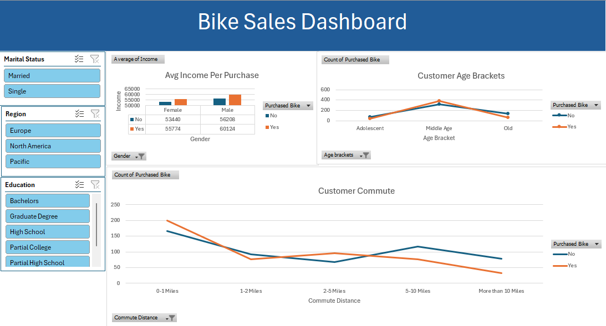

# What is CycleStats ?

CycleStats is an analysis of a dataset of global bike purchases, focusing on various aspects such as customer demographics and buying patterns. The dataset includes information such as customer age, gender, income, commute distance, and more.

 

# Process
- Utilized pivot tables, formulas, formatting, and charts to analyze the data.
- Applied data cleaning techniques to ensure accuracy and reliability, including the removal of duplicates, application of conditional formatting, and handling of invalid values.

# Visualizations
- Clustered Column Chart: Displays the average income per gender.
- Line Chart: Showcases the count of purchased bikes at certain age brackets and the count of purchased bikes for each customer commute distance.

# Purpose
This project aims to provide valuable insights into bike purchasing patterns, helping companies understand customer behavior and make informed marketing and product development decisions.

